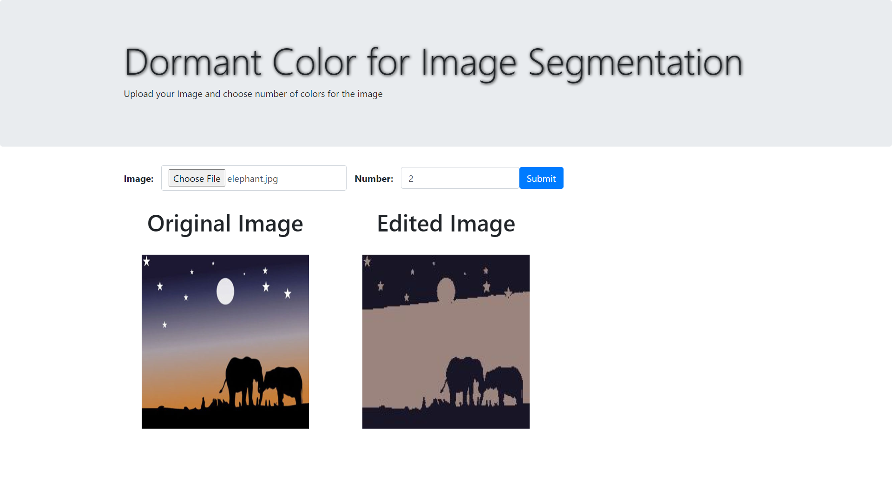
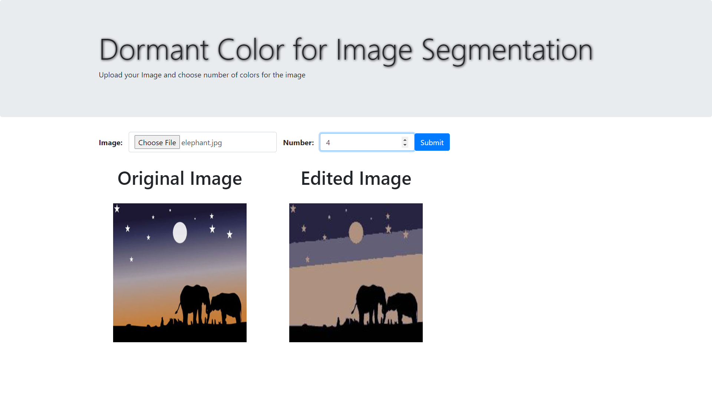

# Dominant-Color-for-Image-Segmentation
This repository contains a web application on finding the dormant color for image segmentation. The python code uses kmeans clustering algorithm for finiding the dormant color in the image, and generate a new image with those dormant colours only. However, number of dormant colors is a user specified parameter.

### Dependencies
  * Flask
  * Numpy
  * Matplotlib
  * OpenCV
  * PIL
  
### Instruction
  * Run `flask run` to run the server. 
  * Input an image and desired number of colours in the edited image.
  
### Results

<b> (with 3 color) </b>
 

<b> (with 2 color) </b>
 

<b> (with 4 color) </b>

